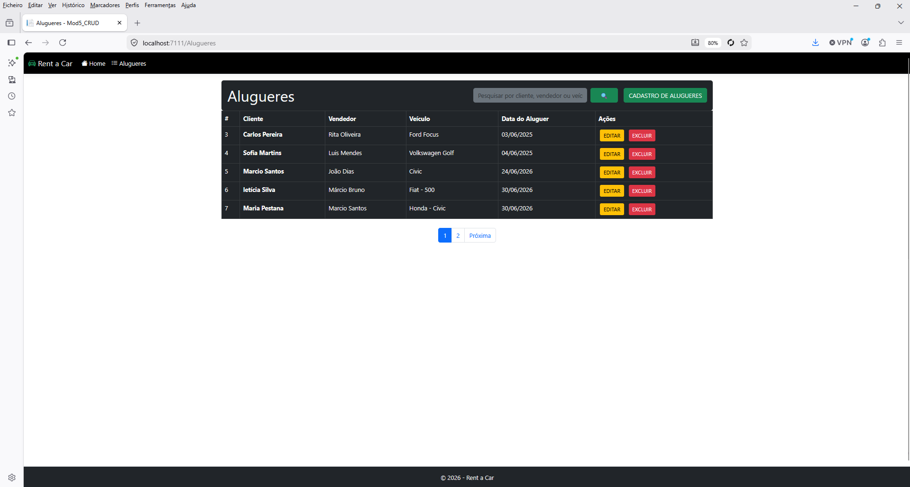
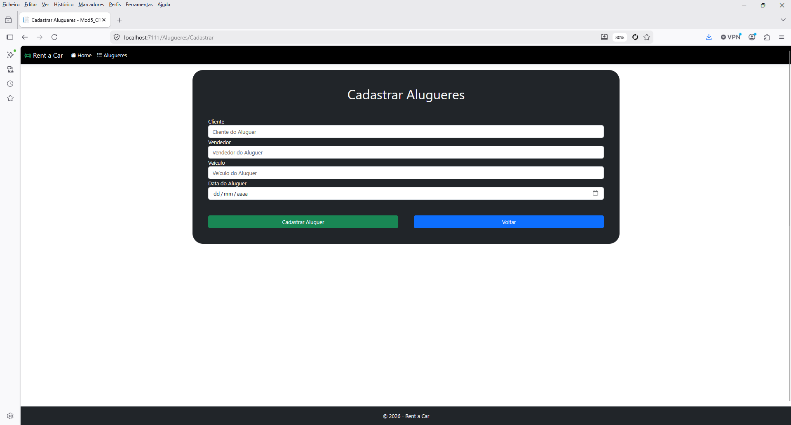
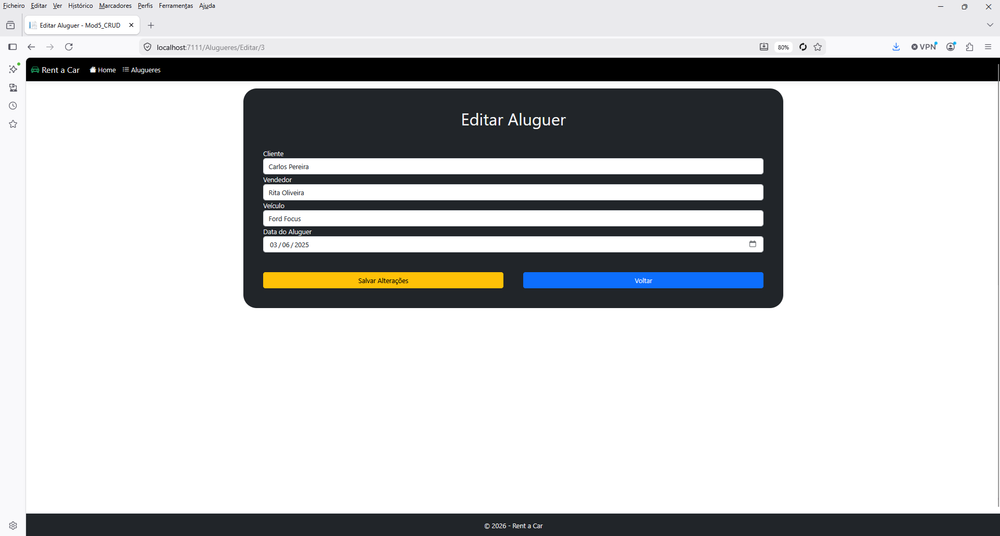
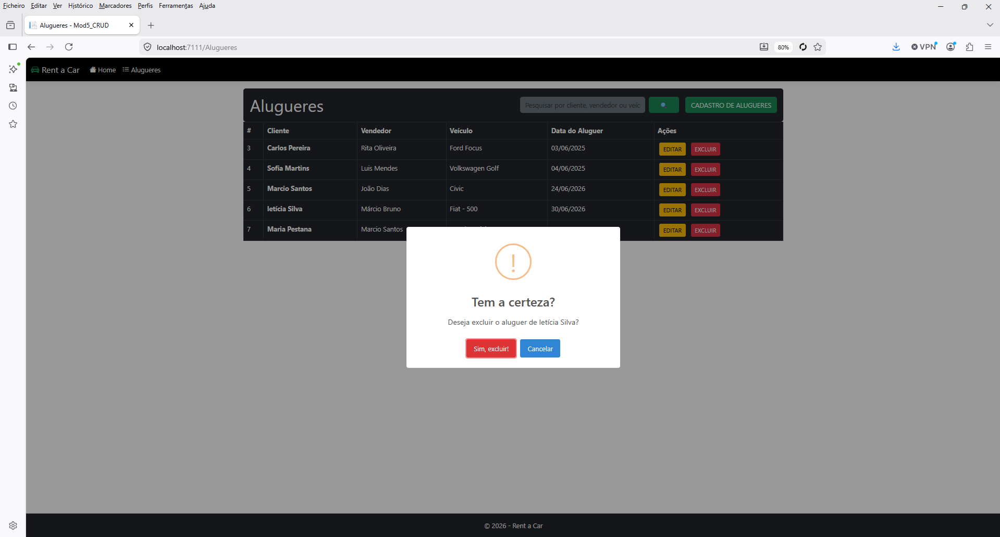

------


```markdown
# 🚗 Rent a Car - Sistema de Gestão de Alugueres


Sistema web desenvolvido em **ASP.NET Core MVC** com **Entity Framework Core** e **MySQL**, que permite gerir alugueres de veículos. O projeto foi desenvolvido no âmbito da **UFCD 10792 - Programação ASP.NET Core MVC**.

---

## 📋 Funcionalidades

| Funcionalidade | Descrição |
|----------------|-----------|
| ✅ **CRUD completo** | Criar, Ler, Editar e Excluir alugueres |
| 🔍 **Pesquisa dinâmica** | Filtrar por cliente, vendedor ou veículo |
| 📄 **Paginação** | 5 registos por página para melhor organização |
| 📱 **Interface responsiva** | Adaptada a todos os dispositivos com Bootstrap 5 |
| 🎨 **Tema personalizado** | Bootswatch - Sandstone |
| 🏷️ **Ícones** | Bootstrap Icons para melhor experiência visual |
| ⚡ **Validação de dados** | No lado do servidor e do cliente |
| 💬 **Mensagens de sucesso/erro** | Utilização de TempData |
| 🗑️ **Confirmação de exclusão** | Com SweetAlert2 |

---

## 🛠️ Tecnologias Utilizadas

| Tecnologia | Versão | Ícone |
|------------|--------|-------|
| .NET | 10.0 |  |
| ASP.NET Core MVC | 10.0 |  |
| Entity Framework Core | 9.0.0 |  |
| MySQL | 8.0+ |  |
| Pomelo.EntityFrameworkCore.MySql | 9.0.0 |  |
| Bootstrap | 5.3.0 |  |
| SweetAlert2 | 11.x |  |
| Visual Studio | 2022 |  |
| Git | Latest |  |

---

## 📁 Estrutura do Projeto

```
📁 Mod5_CRUD/
├── 📁 Controllers/
│   ├── 📄 AlugueresController.cs
│   └── 📄 HomeController.cs
├── 📁 Models/
│   ├── 📄 AlugueresModel.cs
│   └── 📄 ErrorViewModel.cs
├── 📁 Data/
│   └── 📄 ApplicationDbContext.cs
├── 📁 Views/
│   ├── 📁 Alugueres/
│   │   ├── 📄 Index.cshtml
│   │   ├── 📄 Cadastrar.cshtml
│   │   ├── 📄 Editar.cshtml
│   │   └── 📄 Excluir.cshtml
│   ├── 📁 Home/
│   │   └── 📄 Index.cshtml
│   └── 📁 Shared/
│       └── 📄 _Layout.cshtml
├── 📁 wwwroot/
│   ├── 📁 css/
│   ├── 📁 Docs/
│   │   ├── 🖼️ screenshot-index.png
│   │   ├── 🖼️ screenshot-cadastro.png
│   │   ├── 🖼️ screenshot-editar.png
│   │   └── 🖼️ screenshot-excluir.png
│   ├── 📁 img/
│   ├── 📁 js/
│   └── 📁 lib/
├── 📁 Migrations/
├── 📄 appsettings.json
├── 📄 appsettings.Development.json
├── 📄 Program.cs
└── 📄 Mod5_CRUD.csproj
```

---

## ⚙️ Configuração do Ambiente

### 📋 Pré-requisitos

| Recurso | Descrição |
|---------|-----------|
| [.NET 10.0 SDK](https://dotnet.microsoft.com/download/dotnet/10.0) | Framework principal |
| [MySQL Server 8.0+](https://dev.mysql.com/downloads/mysql/) | Base de dados |
| [MySQL Workbench](https://dev.mysql.com/downloads/workbench/) | Gestão do MySQL (opcional) |
| [Visual Studio 2022](https://visualstudio.microsoft.com/) | IDE principal |
| [VS Code](https://code.visualstudio.com/) | Editor alternativo |
| [Git](https://git-scm.com/) | Controlo de versões |

---

### 🚀 Passos para executar localmente

#### 1. Clonar o repositório
```bash
git clone https://github.com/marciobruno-stack/Rent-a-Car.git
cd Rent-a-Car
```

#### 2. Configurar a string de conexão no `appsettings.json`
```json
{
  "ConnectionStrings": {
    "DefaultConnection": "Server=localhost;Database=RentACar;Uid=root;Pwd=sua_password;"
  }
}
```

#### 3. Restaurar os pacotes NuGet
```bash
dotnet restore
```

#### 4. Aplicar as migrações (criar a base de dados)
```bash
dotnet ef database update
```

#### 5. Executar o projeto
```bash
dotnet run
```

#### 6. Aceder no browser
```
https://localhost:5001
```

---

## 🚀 Publicação (Deploy)

### 🖥️ Local (IIS)

| Passo | Ação |
|-------|------|
| 1 | Publicar o projeto: `dotnet publish -c Release -o ./Publish` |
| 2 | Copiar a pasta `Publish` para `C:\inetpub\wwwroot\RentACar` |
| 3 | Criar um novo Site no **IIS Manager** |
| 4 | Configurar o **Application Pool** para **"Sem Código Gerenciado"** |
| 5 | Testar em `http://localhost:8080` |

### ☁️ Azure App Service

| Passo | Ação |
|-------|------|
| 1 | Criar uma Web App no Azure |
| 2 | Publicar diretamente pelo Visual Studio ou VS Code |
| 3 | Configurar a string de conexão nas definições da App Service |

---

## 📸 Screenshots

### Página de Listagem (Index)


### Página de Cadastro


### Página de Edição


### Página de Exclusão com SweetAlert2


---

## 🤝 Contribuição

| Passo | Ação |
|-------|------|
| 1 | 🍴 Fazer um **Fork** do projeto |
| 2 | 🌿 Criar uma **Branch**: `git checkout -b feature/nova-funcionalidade` |
| 3 | ✏️ Fazer **Commit**: `git commit -m 'Adiciona nova funcionalidade'` |
| 4 | 📤 Fazer **Push**: `git push origin feature/nova-funcionalidade` |
| 5 | 🔄 Abrir um **Pull Request** |

---

## 📝 Licença

Este projeto foi desenvolvido para fins educacionais no âmbito da **UFCD 10792 - Programação ASP.NET Core MVC**.

---

## 👨‍💻 Autor

**Marcio Bruno**  
👨‍🎓 Aluno da UFCD 10792 - Programação ASP.NET Core MVC  
📍 Portugal  
🔗 [GitHub](https://github.com/marciobruno-stack)

---

## 🙏 Agradecimentos

- 👩‍🏫 **Formadora:** Cláudia Nunes
- 🤝 **Colegas:** Todos os que contribuíram com feedback e sugestões
- 📚 **Recursos:** Documentação oficial da Microsoft, Bootswatch, Bootstrap Icons

---

## 📞 Contacto

Para dúvidas ou sugestões, pode abrir uma **Issue** no GitHub ou contactar diretamente.

---

## 📊 Status do Projeto


---

**© 2026 - Rent a Car | Todos os direitos reservados** 🚗
```


````````

